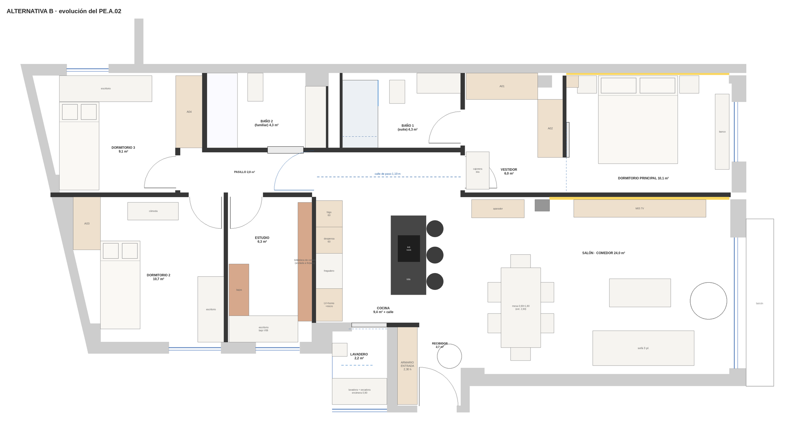
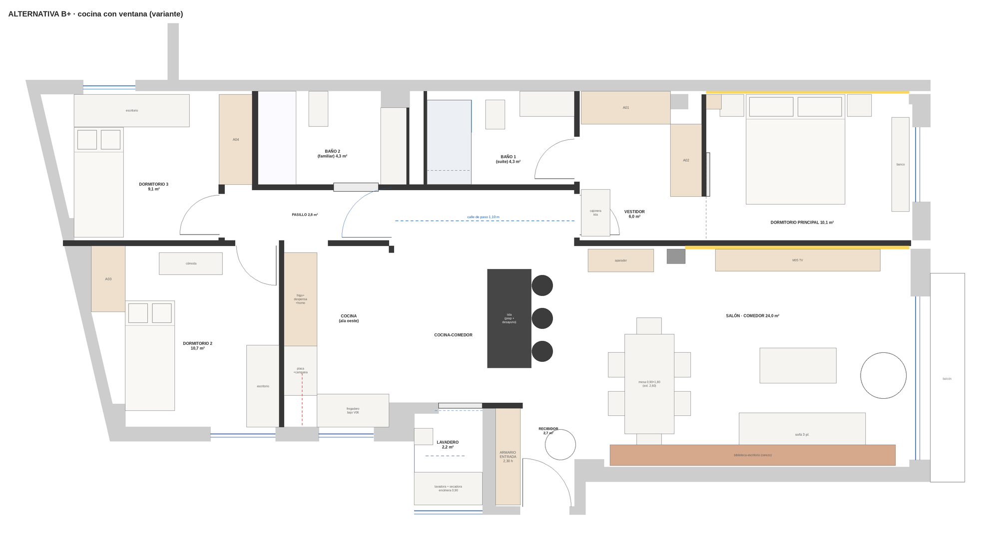

# ALTERNATIVA B AL PE.A.02

_2026-10-02. Contrapartida del informe `ARQUITECTO_CRITICA_PE_A02.md` (los códigos D1…, I1…, M1… remiten a él). Sin importes ni datos del cliente. Todo lo marcado **[verificar]** necesita comprobación en obra, con la arquitecta o con el técnico correspondiente. Las cotas están en metros de modelo (`x` este, `z` sur) y son de diseño: el cocinista y el carpintero las ajustarán ±5 cm._

## 1. Tesis

> **Mantener lo que el proyecto hace bien (zonificación, núcleo húmedo, suite) y rehacer lo que está en el centro: la cocina, la entrada y el límite día/noche. Después, subir el nivel en lo invisible (clima zonificado, ventilación, acústica, electricidad) y en lo visible (menos materiales, más nobles).**

Principios:

1. **Cada mejora cuesta lo mínimo en estructura**: no se mueve ninguna ventana, ni la bajante, ni el pilar, ni el núcleo de escalera.
2. **La cocina deja de ser pasillo** y deja de depender de un ventilador a 1,4 m.
3. **Las puertas hacen trabajo acústico y de intimidad**, no solo de paso.
4. **Menos materiales, mejor ejecutados**: 3 de base + 2 de acento, 2 metales.
5. **Todo lo que se oye, se aísla**; todo lo que se respira, se ventila.

_Rojo/ocre = mobiliario de roble; azul = recorridos y puertas correderas; amarillo = oscuro con LED; negro = tabiquería (0,10 m). Dibujo generado por `scripts/dibujar_alternativa.py`._

---

## 2. Qué se mantiene fijo (restricciones duras)

| Elemento | Dónde | Por qué no se mueve |
|---|---|---|
| Fachadas y muros ciegos | perímetro | estructura, comunidad |
| **8 ventanas V01–V08** | este (V01, V02), sur/oeste (V06, V07, V03/V04/V05), NO (V08) | ya encargadas; el color/hueco exterior depende de la comunidad |
| Pilares | muro norte (x ≈ −1,5 y +3,6), pared de TV (3,44–3,77), rincón SO de la cocina | estructura |
| Muro del lavadero y recibidor (x 0,08–0,32) y muros de la escalera | sur-centro | núcleo de escalera |
| **Bajante** en el patinillo | x ≈ −1,1, z −3,1 | núcleo húmedo del edificio |
| Puerta de entrada PE | (1,215; 4,33) | existente |

Con esto, **el ala oeste (D3, baño 2, D2, estudio) y la suite del este no cambian de sitio** (informe de crítica §8).

---

## 3. Plano B, estancia a estancia

### 3.1 Cuadro de superficies

| Estancia | PE.A.02 (m²) | B (m²) | Cambio |
|---|---:|---:|---|
| Salón · comedor | 24,0 | 24,0 | pared de TV con aislamiento doble (+0,07 m hacia el salón, −0,4 m²) |
| Cocina + franja de paso | 12,9 | 9,4 + 3,7 (calle) | misma superficie; la calle se declara de 1,10 m |
| Recibidor | 2,7 | 2,7 | sin PA02; armario de 2,30 m |
| Lavadero | 2,2 | 2,2 | puerta corredera; tendedero; sumidero |
| Pasillo | 2,8 | 2,8 | puerta P03 acústica |
| Dormitorio principal | 10,1 | 10,1 | puerta corredera de roble |
| Vestidor | 6,0 | 6,0 | armarios reordenados, isla |
| Baño 1 (suite) | 4,3 | 4,3 | canal lineal, nicho |
| Baño 2 (familiar) | 4,3 | 4,3 | mueble y cisterna oculta |
| Dormitorio 2 | 10,7 | 10,7 | armario corredero, cama de 1,35 opcional |
| Dormitorio 3 | 9,1 | 9,1 | armario corredero |
| Estudio | 6,3 | 6,3 | escritorio junto a la ventana |
| **Total útil** | **95,4** | **95,4** | |

### 3.2 Obra de tabiquería (derribos y levantes)

| Acción | Dónde | Notas |
|---|---|---|
| **Derribar** | todos los tabiques de pladur/ladrillo del PE.A.02 y del estado inicial | según demolición |
| **Eliminar** | PA02 (vidrio ácido fijo, x = 1,75; z 2,44–3,47) | se abre la vista a V01 desde la entrada |
| **Levantar** | los mismos tramos de tabique que el PE.A.02, ahora **doble placa 2 × 15 + 70 mm lana, hasta forjado** (Rw ≥ 50 dB en los límites con dormitorios; sencillo 2 × 12,5 + 46 + lana en el resto) | los falsos techos **no puentean** tabiques de dormitorio |
| **Doblar** | pared de TV / suite: dos perfilerías independientes, 2 × 15 + 70 + cámara + 2 × 15 | crece 0,07 m hacia el salón |
| **Nuevo** | puerta corredera de la suite, P03 acústica, PL corredera, armario de entrada de 2,30 m | ver §8 |

---

## 4. Cocina (corrige D1, D2, D3)

### 4.1 Circulación
- **Calle de paso de 1,10 m** (z −1,44 a −0,34, x −1,57 a +1,83) libre de mobiliario, entre los baños y la cocina de trabajo.
- Cocina de trabajo: x −1,53 a 1,83; z −0,34 a 2,44 (9,4 m²).
- Frente–isla: **1,10 m** (antes 0,94): frente a x = −0,93, isla a x = +0,17.

### 4.2 Frente oeste (fondo 0,60, z −0,34 → 2,40; 2,60 m de módulos)
| z | Módulo | Notas |
|---|---|---|
| −0,34 … 0,26 | **Frigorífico combi 60** panelado | puertas de 70° en la calle libre |
| 0,26 … 0,86 | **Columna despensa 60** (extraíble, 2,30 h) | sustituye al «almacenaje» y al «carro de basura» |
| 0,86 … 1,66 | **Fregadero 80**: cubeta única 68 × 42 bajo encimera + escurridor acanalado en el tablero | bajo el fregadero, 2 cubos de reciclaje de 15 l |
| 1,66 … 2,26 | **Columna 60**: lavavajillas panelado (abajo) · horno 60 (a 0,90–1,50) · microondas (1,50–1,95) · armario | — |
| 2,26 … 2,40 | testero de 0,14 | — |

El fregadero queda a ~1,26 m: **mismo punto de agua y desagüe que el PE.A.02**, sin tocar PE/I.04.

### 4.3 Isla (0,80 × 1,80, h 0,90)
- x 0,17 → 0,97; z 0,00 → 1,80. Cuerpo de cajones hacia el oeste; vuelo de 0,25 m al este con **3 taburetes**.
- **Placa de inducción 0,60 × 0,52 con extracción integrada (downdraft)**, conducto plano por el zócalo (o recrecido local de ≥ 9 cm **[verificar cota de forjado]**) hasta el frente oeste y de ahí al falso techo y la galería (recorrido aprox. 4,5 m, ø150 rígido, dos codos, motor remoto en el techo del lavadero); salida por la fachada de V03/V04 (o a cubierta, §9.5).
- **Si se mantiene la campana de techo**: bajar el falso techo sobre la isla en un marco de 1,20 × 0,70 m a **2,05–2,10 m**, con la campana dentro (distancia a placa ~1,15–1,20 m) y caudal ≥ 600 m³/h con motor remoto. El marco, además, define la cocina.
- Tablero: porcelánico o cuarzo oscuro; sin hueco para el fregadero (queda en el frente).

### 4.4 Luz y ventilación de la cocina
- **Tubo solar** (conducto de luz natural) o lucernario sobre la calle/cocina, en cubierta (última planta) **[permiso de la comunidad]**.
- **PL**: puerta corredera de vidrio translúcido de 1,0 m, enrasada al muro de la cocina: más luz de V03/V04 y no barre el lavadero.
- **Cruce de aire**: V01 ↔ V03/V04: dejar la corredera abierta con ventilación nocturna.
- Iluminación de trabajo 3000 K (no 4000 K), 500 lx en encimera; tira bajo altos al 100 %.

---

## 5. Entrada (corrige D5)

- **Armario de entrada de 2,30 h** en el muro oeste (x 0,32–0,77; z 2,54–4,30; 0,45 × 1,76 m): ropero (0,90 m de barra), zapatero abatible, cajón de llaves y hueco para el robot aspirador. Una de las puertas lleva el espejo redondo del proyecto.
- **Sin PA02**: desde la puerta se ve el ventanal V01 al fondo.
- La hoja de PE a 90° queda a 4 cm del frente del armario: no choca.
- Opcional: banco de 0,35 m en la pared este, junto a la puerta.
- Pavimento: el mismo que el salón (sin tira de transición); el umbral de PE con rotura de puente acústico.

---

## 6. Suite (corrige D4)

- **Puerta corredera de roble** (0,80 × 2,10) sobre carril, deslizando por la cara del dormitorio sobre el panel PA01; cierra el hueco de 0,78 m entre vestidor y dormitorio, con la misma lama que el panelado.
- **P01** (de la cocina al vestidor): hoja acústica de 0,80, con burlete y cierre.
- **Vestidor**: A01 (1,64 m) y A02 (1,32 m) se mantienen; se añade una **cajonera-isla de 0,90 × 0,52 m** a x 1,88–2,40 (sin bloquear P02); luz de presencia 3000 K; 3,0 m de barra + 1,5 m de cajones.
- **Dormitorio**: se mantienen cama de 1,80 × 2,00 y mesitas; el **estor oscurecedor** va en cajón a techo sobre V02; cabecero de listones con tira LED indirecta (oscuro a z −3,24, ya previsto).
- **Pared de TV doble** (§3.2): corta el ruido de la tele hacia la cama.
- **Baño 1**: ducha de **0,80 × 1,54** con **canal lineal** (pendiente única 1,5 %) y porcelánico 60 × 120 sin cortar; mampara fija de 0,80; nicho de 0,60 × 0,21 a 1,10 m; inodoro suspendido con bastidor autoportante y registro por el pulsador; M02 (armario sobre el inodoro) de 1,20 a 2,31 en lacado blanco.

---

## 7. Zona de noche (corrige D6–D9)

- **P03 acústica**: hoja de 0,90 × 2,30, vidrio laminar acústico 6+6 translúcido (Rw ≥ 33 dB), perfil de roble o de acero negro, burlete perimetral y **cierre automático inferior**. Mantiene la idea de luz prestada, pero ahora con rendimiento.
- **Pasillo**: puertas de **2,30 de altura** con marco oculto (alineadas con el falso techo de 2,30), misma altura que P03/PL; cuatro de lacado blanco (P05, P06, P07, P04 corredera). **Luz nocturna** de balizas LED a 0,30 m, 2200 K, con detector de presencia. Sin retorno de aire por el plenum (§9).
- **Dormitorio 2 y 3**: **armarios con puertas correderas de suelo a techo** (D2: 1,20 m; D3: 1,64 m); camas nido de 0,90 o, si hay invitados, **cama de 1,35 m con canapé abatible** en D2 (admite el escritorio de 1,49 m).
- **Estudio**: la biblioteca de cerezo sobre la pared este, **anclada al forjado** con escuadras y refuerzo en el pladur; el **escritorio se coloca bajo V06** (x −3,50 a −1,94; z 2,28 a 2,88; 0,60 de fondo) con luz natural lateral; los bajos de cerezo en L en el lado oeste; silla con vista a la ventana y a la biblioteca.
- **Baño 2**: mueble de 1,40 m con **cajones de compacto o chapa de roble hidrófugo** (nunca melamina); inodoro suspendido (en vez de cisterna vista) con bastidor; bañera de 1,70 × 0,70 con faldón de porcelánico y trampilla de registro; mampara fija de vidrio; grifería de bronce cepillado.

---

## 8. Lavadero (corrige D11)

- **PL corredera de vidrio translúcido** y perfil negro, 1,00 × 2,30.
- Encimera de 0,90 sobre **lavadora + secadora de bomba de calor** (menos calor y sin tubo de salida); **tendedero de techo** extensible.
- **Sumidero sifónico** y bandeja bajo las máquinas; llave de corte general y de zona.
- **Descalcificador** (agua dura) en el lavadero, con by-pass.
- Calentador mural donde está ahora, o **termo de bomba de calor** si se decide aerotermia **[decidir ACS: I4]**.

---

## 9. Instalaciones (corrige I1–I7)

### 9.1 Climatización
- **Cálculo de cargas** (cubierta + 2 fachadas): puede pedir **9–10 kW** en vez de 7,1 **[verificar]**.
- **3 zonas con compuertas motorizadas y termostatos propios**: día (salón + cocina), noche (D2, D3, estudio) y suite (vestidor + dormitorio + baño 1).
- Difusores lineales en **todas** las estancias de uso (salón 2,20 m; suite 1,80 m; D2, D3 y estudio con rejilla de impulsión propia a 0,5 m de la ventana).
- **Retorno canalizado con silenciador** en lugar de plenum; así los dormitorios dejan de compartir ruido.
- **Registro** y **unidad en el techo del baño 2** solo si la sección da plenum ≥ 0,30 m; si no, **unidad en el pasillo** (z −1,0).
- **Unidad exterior**: cubierta de la comunidad (preferente) o balcón con pantalla de lamas **[ubicación pendiente]**.
- **ERV** (recuperador de calor) de 150–200 m³/h en el techo del pasillo para admisión filtrada y extracción de baños/cocina: pasa por los mismos conductos y evita 7 aireadores.

### 9.2 Ventilación general (DB-HS3)
- **Admisión**: aireadores acústicos (Dn,e,w ≥ 35 dB) en cajones de persiana de dormitorios y salón, o ERV.
- **Extracción**: baños 15 l/s cada uno por patinillo; cocina independiente (campana) a fachada o cubierta.
- Hay que **documentarlo** en el proyecto **[verificar con la arquitecta]**.

### 9.3 Electricidad
- **9,2 kW (electrificación elevada)**; circuitos independientes: inducción, horno, lavavajillas, lavadora, secadora, clima, termo, 2 de luz, 2 de enchufes, domótica.
- **Protección contra sobretensiones** permanente y transitoria; diferenciales tipo A (superinmunizados para inducción y clima); **30 % de reserva** en el cuadro.
- **Tomas**: 2 en cada mesita, en el cabecero del estudio y en cada puesto de trabajo; USB-C en cocina; toma para robot aspirador en el armario de entrada; **punto de datos cableado en cada dormitorio, estudio y salón**.
- Persianas de V01 y V02 motorizadas con **sensor de viento**.

### 9.4 Fontanería y ACS
- **Presión reducida**, llaves de corte por baño, cocina y lavadero; **detector de fugas con electroválvula**.
- **Recirculación de ACS** si el calentador/termo se mantiene en el extremo sur; si no, **termo de bomba de calor** en lavadero o equipo en el pasillo.
- **Desagües**: el fregadero se mantiene a ~4,8 m de la bajante: pasa por el trasdós del frente oeste a 0,12 m de altura con pendiente 7 %, sin tocar el suelo salvo el cruce de la calle (recrecido local ≥ 6 cm) **[verificar cota de forjado]**.

### 9.5 Cubierta (permiso de la comunidad)
- **Tubo solar** (Ø 350) sobre la calle/cocina.
- **Salida de humos vertical** de la cocina (rígido ø150) a través de la cubierta, si se acepta; si no, por fachada V03.

### 9.6 Iluminación
| Zona | Lux | Luz | Detalle |
|---|---|---|---|
| Salón-comedor | 150–300 | 2700–3000 K, regulable | dos escenas; lámpara de comedor sobre mesa; downlights solo perimetrales |
| Cocina | 300 general / 500 encimera | 3000 K | tira bajo altos continua; luz sobre isla |
| Baños | 200 general / 500 espejo | 3000 K, CRI ≥ 95 | luz vertical a ambos lados del espejo; sin sombras en la cara |
| Dormitorios | 100 / 300 en lectura | 2700 K regulable | lecturas en mesita; interruptor desde la cama |
| Estudio | 500 | 3500 K | luz lateral a la mesa |
| Pasillo, entrada | 100 / 150 | 2700 K | balizas nocturnas con detector |

- **Mismo color en toda la casa**; CRI ≥ 90 y UGR < 19.
- **Pared de TV, cabecero y biblioteca**: LED rasante con **yeso Q4**.

### 9.7 Acústica
- **Suelo flotante**: lámina antiimpacto con ΔLw ≥ 20 dB bajo el pavimento y bandas perimetrales.
- **Tabiques hasta forjado** (§3.2) y falso techo discontinuo sobre dormitorios.
- **Puertas** con burlete y cierre inferior (P03, P01, dormitorios).
- **Ventanas**: Rw ≥ 32–35 dB y vidrio de control solar en V01/V02 (factor solar g ≤ 0,40) **[comprobar con la carpintería]**.

---

## 10. Materiales (corrige M1–M10)

**Paleta**: base **blanco cálido (paredes y techos), roble natural, porcelánico tipo travertino**; acentos **un solo mineral oscuro** (Silestone o Dekton, no los dos) y **bronce cepillado + negro mate** como únicos metales.

| Estancia | Suelo | Pared | Techo | Notas |
|---|---|---|---|---|
| Salón-comedor + cocina | **porcelánico 30 × 120 efecto roble**, rectificado, junta ≤ 2 mm | pintura mate lavable; **pared de TV de porcelánico gran formato** | pladur 2,46 / 2,30 | continuo, sin escalón |
| Recibidor | igual | igual | 2,30 | umbral con rotura de puente acústico |
| Pasillo, dormitorios, estudio, vestidor | **parquet multicapa de roble 14–15 mm** (capa noble 3 mm), aceite mate, sobre lámina acústica | pintura mate | 2,46 / 2,30 | cálido y silencioso; transición en el umbral de P03 y P01 |
| Baños | porcelánico antideslizante R10 60 × 120 | **a techo en zona de agua**, a 1,20 m con pintura antimoho en el resto | hidrófugo 2,30 | impermeabilización en ducha y bañera; ducha con canal lineal |
| Lavadero | porcelánico R10 con sumidero | porcelánico 1,20 | 2,46 | encimera Dekton |

### Carpintería a medida
- **Frentes visibles** (cocina alta, mueble TV, aparador, vestidor, armario de entrada): **chapa natural de roble sobre MDF hidrófugo**, barniz poliuretano al agua mate, cantos macizos de 3 mm; interiores en gris grafito.
- **Muebles de baño**: compacto HPL o chapa de roble hidrófugo; nunca melamina.
- **Biblioteca de cerezo**: se mantiene tal cual, **solo en el estudio**.

### Piedra y encimeras
- **Un solo mineral oscuro** para encimeras de cocina y isla, mate (Silestone Charcoal Soapstone o equivalente), **Dekton** solo en lavadero.
- **Salpicadero** a juego, sin junta horizontal.
- **Grifería de cocina en negro mate o PVD**; resto, **bronce cepillado**.

### Pilar y pared de TV
- **No picar el pilar** sin informe: sustituir por **microcemento tono hormigón** o paneles de hormigón fino, con el mismo efecto.
- **Pies de la mesa**: porcelánico de gran espesor o travertino **hueco**; si es macizo, comprobar con el estructurista.

### Ventanas y puertas
- V01/V02: **exterior en el color de la comunidad** (si el cobre no se autoriza, bronce oscuro) y vidrio de control solar.
- **Todas las puertas a 2,30 m**, marco oculto, laca blanca en dormitorios y roble en P03/P01.
- **Manivelas** en bronce cepillado o negro mate, cerraduras magnéticas silenciosas.

### Acabados varios
- **Rodapié enrasado** (junta de sombra) en blanco; **sin rodapié visible** en pared de TV y cabecero.
- **Pintura**: acrílica mate lavable clase 1 en zonas de uso; **antimoho** en baños; **blanco cálido** continuo.
- **Interruptores**: serie en blanco o negro mate, a 110 cm.

---

## 11. Mobiliario

| Pieza | PE.A.02 | B | Motivo |
|---|---|---|---|
| Mesa comedor | tablero de cristal 12 mm, 0,90 × 1,80 | **tablero de roble macizo o Dekton**, extensible a 2,60 | huellas, ruido, 6–8 comensales |
| Pies de mesa | travertino macizo (~215 kg) | porcelánico/travertino hueco | carga puntual (M6) |
| Sofá | 3 plazas, 2,30 m | **3 plazas con chaise, 2,60–2,90 m**, tapizado desenfundable | familia; invitados |
| Butaca | BKF cuero | se mantiene | — |
| Mesa de centro | dos bloques + cristal | **bloque único** de roble y piedra ligera | peso, niños |
| Cama principal | 1,80 × 2,00 | igual, **somier con canapé** | almacenaje de ropa de cama |
| D2 y D3 | nido 0,90 | **nido 0,90 o cama 1,35 en D2** | flexibilidad |
| Armarios D2/D3 | batientes | **correderos 2,30 h** | pasos y aprovechamiento |
| Taburetes | 3, negros | 3, **asiento tapizado** | comodidad, ruido |
| Cortinas | ninguna | **estor screen** (V01) + **oscurecedor** (V02, dormitorios) | control solar y descanso |

---

## 12. Variante B+ · cocina con ventana (la apuesta mayor)

**Idea**: el único cambio estructural que mejora a la vez luz, ventilación y extracción es **convertir el estudio en cocina**, con V06 sobre el fregadero.

| Cambio | Detalle |
|---|---|
| Se derriba | tabique estudio/cocina (x −1,62 a −1,53) |
| Cocina oeste | frente oeste (frigo, despensa, horno) y frente sur (fregadero bajo V06, placa); **campana a la fachada por el machón entre V07 y V06** (0,79 m): conducto de ≈1,5 m |
| Comedor | se queda en el salón (mesa existente) o se acerca a la isla |
| Estudio | desaparece como estancia: **biblioteca-escritorio de cerezo** en el muro sur del salón (6 m de muro ciego) |
| P05 | desaparece |

**Ganancias**: cocina de ~15,4 m² con **ventana (1,2 m²)**, **ventilación cruzada con V01**, **extracción de 1,5 m a fachada** y fin del conflicto D1/D3.
**Costes**: se pierde el estudio (6,3 m²); la biblioteca de cerezo se ve desde el salón; el fregadero queda a ~7 m de la bajante (desagüe por trasdós a 4,7 %, o **bomba de achique**) **[verificar que no existe una segunda bajante en el bloque SO de la cocina]**; la cocina queda pegada al dormitorio 2 (doble tabique con lana).

**Recomendación**: **B** como solución de partida; **B+** solo si se confirma el desagüe y a la familia le basta con un despacho integrado.

---

## 13. Alternativas descartadas

| Idea | Por qué no |
|---|---|
| Cocina cerrada con despensa | pierde la luz compartida y la integración; la solución con puerta corredera de vidrio queda como opción de B |
| Aseo de cortesía | no hay sitio sin comerse un baño o el lavadero; el recorrido al Baño 2 es corto |
| Cuarto dormitorio | solo cabe sacrificando salón o estudio |
| Cocina en el este | ocupa la única fachada de vistas |
| Suite en el noroeste | trapecio, ventana de 1,17 m y lejos de la bajante |
| Jack & Jill (baño 1 con dos puertas) | pierde intimidad de la suite |

---

## 14. Verificaciones previas

1. **Secciones y cotas de forjado** (plenum, recrecidos, desagües).
2. **Cálculo de cargas** y selección de la unidad de clima.
3. **Orientación real** (brújula + Street View) para decidir protecciones.
4. **Informe del técnico sobre el pilar** y las cargas puntuales.
5. **Comunidad**: color de V01/V02, unidad exterior, tubo solar y salida de humos.
6. **Bajantes** (¿existe una en el bloque SO de la cocina? ¿estado de la principal?).
7. **Ventilación DB-HS3** documentada.
8. **ACS**: gas, termo o aerotermia.

## 15. Decisiones abiertas para la familia

1. ¿B o B+? (¿se necesita un despacho independiente?)
2. ¿Parquet en la zona de noche o continuidad total en porcelánico?
3. ¿Qué mineral oscuro: Silestone o Dekton?
4. ¿Cama de 1,35 en D2?
5. ¿Tubo solar y salida a cubierta si la comunidad los permite?

## 16. Qué habría que tocar en el repositorio si se adopta

`spec_mobiliario.md`, `data/puertas.json` (P03, P01, PL, corredera de la suite, PA02 fuera), `scripts/mobiliario_proyecto.py` (cocina, armario de entrada, vestidor), `scripts/generar_blender.py` y regenerar GLB/visor. No se ha modificado nada del modelo: esta alternativa es solo documentación y planos (`scripts/dibujar_alternativa.py`).
