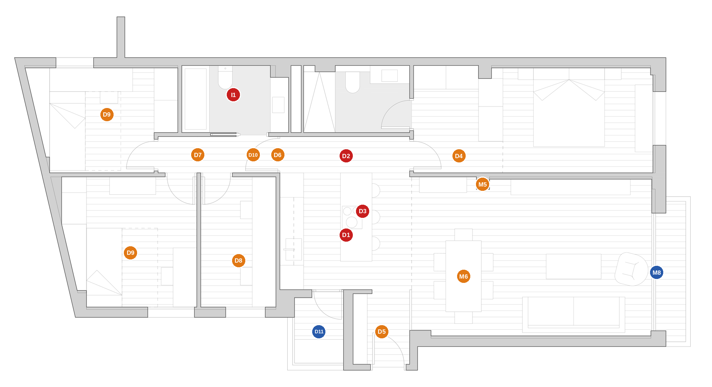

# ANÁLISIS CRÍTICO DEL PROYECTO ACTUAL (PE.A.02)

_2026-10-02. Rol: arquitecto. Sin importes ni datos del cliente. Fuente: planos PE/A.01–A.04 y PE/I.01–I.09 (`Planos/`), `data/planos3d.json`, `data/puertas.json`, `data/ventanas.json`, `spec_mobiliario.md`, renders de `data/reales/`. Las cotas salen de esos ficheros; lo que no se puede comprobar con ellos va marcado como **[verificar]**._

_Rojo = grave, naranja = medio, azul = menor. Las etiquetas corresponden a los números de este informe._

---

## 0. Veredicto en diez líneas

1. **El esquema general es correcto**: zona de día abierta al este, noche al oeste, núcleo húmedo pegado a la bajante, suite al fondo. No hay que rehacer la casa.
2. Con ventanas, bajante y estructura fijas, **la mayoría de los tabiques ya están donde mejor pueden estar** (§8). Tirar todo no cambia eso; lo que sí puede cambiar es el centro de la planta.
3. **El problema mayor es la cocina**: 12,9 m² interiores, sin hueco propio, a 6–9,5 m del único ventanal, y que además hace de pasillo (D1–D3).
4. La **campana de techo queda a 1,38 m de la placa** (2,28 − 0,90) y sin salida definida: en planta abierta, los olores se quedan en el salón.
5. **Climatización**: una sola unidad de 7,1 kW y un termostato para ~95 m² en última planta, sin zonificar y con retornos por plenum común (I1).
6. **Ventilación general (DB-HS3), eléctrica (5,75 kW) y acústica** no están resueltas en la documentación que existe.
7. **La suite no tiene puerta propia** y se accede atravesando el vestidor desde la esquina de la cocina (D4).
8. **Materiales**: la paleta tiene demasiadas familias (roble, travertino, dos piedras, hormigón, cristal, bouclé, cobre, negro, bronce) y la melamina «efecto roble» carga los elementos protagonistas (M2–M3).
9. **Dos riesgos estructurales que hay que cerrar antes de obra**: el picado del pilar y las cargas puntuales de los pies de travertino macizo (M5–M6).
10. **La documentación se contradice** en el nombre de los baños, en el pavimento y en las superficies (§7); los informes antiguos (julio) describen otra casa.

---

## 1. Qué se ha analizado y con qué límites

| Fuente | Uso |
|---|---|
| PE/A.01 estado inicial, PE/A.02 distribución, A.03 cotas, A.04 baños | geometría y cotas |
| PE/I.01 albañilería y pladur, I.03 electricidad, I.04 fontanería, I.05 clima, I.05/06 carpintería exterior, I.06/07 carpintería interior, I.09 encimeras | instalaciones y detalles |
| `spec_mobiliario.md`, `data/*.json` | mobiliario y datos medidos |

Límites: **no hay secciones ni planta de techos** (las alturas salen de los rótulos «h=»); no hay ensayos de estructura ni medición de ruido; la orientación es dudosa (§7). Los informes de julio (`ARQUITECTO_*`, `DISTRIBUCION_POR_ESTANCIAS`) se escribieron desde presupuestos, no desde el PE.A.02, y **no se han usado como fuente**.

Datos de partida: 13 estancias, 95,4 m² útiles + balcón 2,6 m²; alturas libres 2,46 m (dormitorios, salón, estudio, lavadero) y 2,30 m (baños, vestidor, pasillo, cocina, recibidor); última planta (7.ª) de un edificio PB+7.

---

## 2. Lo que está bien (y conviene no tocar)

- **Zonificación día/noche** clara, con el salón-cocina como espacio único de 37 m².
- **Núcleo húmedo compacto** a ambos lados de la bajante (baños + patinillo), con el mismo trazado que el estado inicial: mínimo recorrido de saneamiento.
- **Los tabiques de dormitorio 2 / estudio caen en el machón entre V07 y V06** (0,79 m): detalle limpio de encuentro con fachada.
- **Dormitorio principal con ventana propia, vestidor y baño** en una sola ala; el cabecero queda contra el muro ciego.
- **Luz prestada** bien pensada: puerta de la galería (V05/PL) y vidrio ácido (PA02) llevan luz al interior.
- **Espina de servicios a 2,30 m** (pasillo–cocina–vestidor–baños) que concentra conductos y deja 2,46 m en las estancias principales.
- **Pilar visto + pared de TV + tira LED** convierten un estorbo en composición.
- **Mobiliario a medida** bien dimensionado en general: TV a ~3 m del sofá, 1,30 m entre taburetes y sillas, 0,94 m entre frente de cocina e isla.
- **Reutilizar la biblioteca de cerezo** del cliente es una decisión de coste y de memoria.

---

## 3. Distribución

### D1 · Cocina interior sin luz ni ventilación propias — **grave**
La cocina (12,9 m², h 2,30) no tiene ningún hueco. Recibe luz del ventanal V01 a **6–9,5 m**, y de la galería a través de V05 (vidrio translúcido, 0,8 m). El ventanal V01 da 6,3 m² de vidrio al salón (26 % de la superficie); la cocina, 0 %. Con un falso techo a 2,30 y una isla oscura, **la luz artificial estará encendida todo el día**. La ventilación cruzada (V01 ↔ V03/V04/V05) depende de dejar abierto un recorrido de 10 m.
_Remedios_: luz cenital (tubo solar en cubierta, última planta), V05 con vidrio traslúcido de mayor transmisión, o mover la cocina a una fachada (variante B+ de la alternativa).

### D2 · La cocina es el pasillo — **grave**
Todo el tránsito dormitorios → salón y dormitorios → suite pasa por la franja entre los baños y la cabeza de la isla: **0,92 m** (z −1,44 a −0,52), con el frigorífico combi pegado a ella. El DB-SUA y el uso real (dos personas cruzándose con una bandeja) piden ≥1,00 m, mejor 1,10 m en ruta de paso con puertas en ambos extremos (P03 y P01). Es el punto de fricción de toda la casa.

### D3 · Placa en isla con campana de techo a 1,38 m — **grave**
La campana va enrasada en el falso techo (2,28–2,30) sobre una placa a 0,90: **1,38 m**. Lo habitual es 0,65–0,85 m; las campanas de techo compensan con caudal y captura perimetral, pero a esa altura la captura es dudosa **[pedir al fabricante la altura máxima de instalación]**. Además: la salida es «flexible ø150» (PTW070) sin recorrido, la isla está a ~4 m de la fachada más cercana (galería), la placa es vitrocerámica de tres zonas (más humo y más pérdida de calor que inducción) y el recibidor está a 2 m de la placa: el visitante entra respirando lo que se cocina. En un piso con salón abierto, esto se nota el primer día.

### D4 · La suite se cruza y no tiene puerta — **medio**
Camino: cocina → P01 (esquina de la franja) → vestidor → hueco de 0,78 m → dormitorio. **No hay puerta entre vestidor y dormitorio**, y el baño 1 se abre al vestidor. Consecuencias: ruido y luz del vestidor/baño sobre la cama; el vestidor es un pasillo de 1,62 m con dos armarios y dos puertas (P01, P02) que barren su suelo; la intimidad depende de una sola hoja (P01) situada en la esquina de la cocina.
Además, el pie de la cama queda a **0,66 m** de la pared del salón (z −1,18 a −0,52): ajustado pero admisible; y esa pared es la del televisor.

### D5 · Entrada pobre — **medio**
Recibidor de 1,43 × 1,82 m (2,7 m²). Equipamiento: un zapatero **suspendido** (0,20–0,90 m) y un espejo; **no hay ropero** ni lugar de paquetes. El separador PA02 (vidrio ácido fijo) tapa la vista al ventanal, y la primera imagen al entrar es el hueco hacia la cocina y la isla. La hoja de entrada (0,88, existente) barre media entrada.

### D6 · Separación acústica día/noche débil — **medio**
La única barrera entre cocina–salón y tres dormitorios es **P03**: una puerta de roble y vidrio translúcido (0,98 × 2,30) pensada para dejar pasar la luz. Una puerta con vidrio simple y sin burlete ronda 20–25 dB; para dormir con la cocina o la tele al otro lado hace falta bastante más. Los tabiques son de 10 cm con lana (tabique sencillo, estimación Rw 42–45 dB).

### D7 · Pasillo de 0,92 × 3,1 m con cinco huecos — **medio**
P03, P04 (corredera), P05, P06 y P07 en 3,1 m: ningún armario, ninguna luz natural, sin ventilación y con retorno de clima. Está bien resuelto en lo geométrico (las hojas abren hacia dentro de las estancias, P04 es corredera), pero es una caja oscura. Las puertas de 2,03 m dejan una banda de 27 cm a techo.

### D8 · Estudio estrecho y mal iluminado — **medio**
1,85 × 3,30 m. La mesa (península de cerezo, z 0,45–1,05) queda a ~2 m de la única ventana (V06, 1,0 × 1,21 m, al sur): luz natural escasa en el puesto de trabajo. La biblioteca (≈2,8 m de estantería alta, con libros) se apoya en un **tabique de pladur de 9 cm**: hay que anclarla a forjado y reforzar el trasdós **[verificar con carpintero y pladurista]**.

### D9 · Dormitorios 2 y 3: válidos pero rígidos — **medio**
Camas nido de 0,90 m (sirven para niños, no para un adulto o una pareja de invitados), armarios de 1,20 m (D2) y 1,64 m (D3) y estanterías trapezoidales de aprovechamiento dudoso. D3 es un trapecio con la cama junto a un muro oblicuo: el 9,1 m² reales rinden menos. Ventanas de 1,17 × 1,21 m (13–16 % de la superficie): cumplen, sin sobrar.

### D10 · Sin aseo de visitas — **medio**
Los invitados usan el Baño 2 (bañera), que es también el baño familiar; el Baño 1 es de la suite. El recorrido es corto (cocina → P03 → P04) y no pasa por puertas de dormitorio, así que **es aceptable**; solo se vuelve problema si se recibe a menudo.

### D11 · Lavadero muy justo — **menor**
1,24 × 1,80 m (2,2 m²): calentador, lavadora y secadora bajo encimera, y una hoja de 0,70 m que barre 0,70 m dentro (deja 0,5 m delante de las máquinas con la hoja abierta). Sin sumidero ni tendedero; la galería es exterior a la envolvente térmica (V05 es carpintería exterior) y está enfrente de V03/V04 translúcidas.

### D12 · Almacenaje general ausente — **menor**
No hay despensa dedicada, escobero/aspiradora, maletas, ropa de cama, herramientas. El «casoneto» de la memoria de julio ya no existe. Armarios en dormitorios: ≈3,0 m (suite), 1,2 m (D2), 1,64 m (D3).

---

## 4. Instalaciones y confort

### I1 · Climatización — **grave**
- Una unidad por conductos de **7,1 kW** (nominal) para ~95 m² en **última planta** (cubierta + dos fachadas acristaladas): hace falta un **cálculo de cargas** que el expediente no recoge **[verificar]**.
- **Un solo termostato** (pasillo): sin zonas día/noche/suite; no se puede cerrar el aire de los dormitorios por la mañana ni el del salón por la noche.
- PE/I.05 solo dibuja **dos difusores lineales** (salón 2,20 m y suite 1,80 m); dormitorios 2, 3 y estudio parecen alimentarse **por transferencia desde el pasillo** y retornar por plenum.
- **Retornos por plenum comunes** (dormitorios 2/3/estudio, salón, suite): el falso techo continuo es un camino de ruido entre dormitorios.
- La máquina interior (1,00 × 0,60) se sitúa en el techo del Baño 2 a 2,30 m: con un plenum de ~0,24–0,30 m **[verificar con sección: altura de la máquina + registro de 40 × 60]**.
- Unidad exterior no ubicada; el balcón (0,63–0,76 m de fondo) es estrecho para una máquina de 7 kW con distancias de servicio **[verificar]**.

### I2 · Ventilación general (DB-HS3) — **medio-grave**
No consta el sistema de ventilación de la vivienda: ni aberturas de admisión (aireadores en cajones de persiana) en dormitorios y salón, ni caudales de extracción, ni el trazado del conducto de la campana (D3). Los **dos baños son interiores** (ni una ventana) y se extraen por rejilla en un patinillo compartido. Con carpinterías nuevas estancas, sin admisión no hay renovación **[verificar cómo se resuelve]**.

### I3 · Potencia eléctrica — **medio**
Se recomienda 5,75 kW. Con placa de tres zonas, horno, microondas, lavavajillas, lavadora, secadora, clima por conductos y termo/calentador, la demanda simultánea supera esa cifra con facilidad. Plantear **electrificación elevada (9,2 kW)** y confirmar con el instalador. La red de PE/I.03 (circuitos de luz en curva) está bien en recorrido; faltan subcuadro/circuitos específicos (secadora, clima, inducción) y protección contra sobretensiones.

### I4 · Agua caliente — **medio**
El calentador está en la galería (extremo sur) y los baños en el norte: **11–12 m de tubería** por recorrido. Con multicapa Ø16 son ~1,4 l de agua fría que tirar y 30–60 s de espera en cada uso. Sin recirculación. Aceptable, pero evitable con una solución de ACS acordada (el estado inicial usaba gas natural con calentador estanco; el proyecto no fija el nuevo).

### I5 · Acústica — **medio**
- **Ruido de impacto** a la vivienda inferior (porcelánico sobre forjado): lámina antiimpacto no especificada.
- **Pared de TV = pared de la suite**: un tabique sencillo de 10 cm.
- Tabiques que deben llegar al forjado (si no, el falso techo continuo los puentea).
- Ventanas: no figuran Rw/RA,tr, g ni U **[verificar con la carpintería]**.

### I6 · Iluminación — **medio**
34 downlights en spot 70° + tiras en oscuros. Bien de cantidad. Faltan: **calidad de luz** (CRI ≥ 90, 2700–3000 K regulable), **luz nocturna** (pasillo, baños), regulación en salón/dormitorios, y que las tiras LED rasantes (pared TV, cabecero) **delatan cualquier defecto de la pared**: exigen acabado de yeso Q4. Dos temperaturas (3000 K y 4000 K en cocina) crean un salto de color visible en un espacio abierto.

### I7 · Cubierta y última planta — **menor**
Sin cálculo térmico de la cubierta (comunitaria). Oportunidad: tubo solar o lucernario para la espina interior; salida de humos vertical a cubierta. Ambos requieren permiso de la comunidad.

---

## 5. Materiales

| ID | Hallazgo | Gravedad |
|---|---|---|
| **M1** | **Pavimento**: el modelo/AGENTS dice «madera en toda la vivienda salvo baños»; las memorias dicen «mármol en recibidor y cocina»; el formato («25 × —») está sin cerrar; falta lámina acústica y juntas de dilatación. | medio |
| **M2** | **Melamina «imitación roble»** en frentes de cocina, armarios, aparador, mueble TV y muebles de baño: los elementos que más se ven son los de menor calidad; en baños la melamina se hincha en cantos con la humedad. | medio |
| **M3** | **Demasiadas familias**: roble, travertino (pared, mesa, mesitas, baños), Dekton, Silestone Charcoal, hormigón picado, cristal, bouclé, cuero, cerezo (biblioteca), y metales cobre, negro mate, bronce, acero negro, cromo. En un espacio abierto de 37 m² compiten. | medio |
| **M4** | **Superficies oscuras mates + grifo negro + agua dura** (habitual en Valencia): marcas de cal y grasa visibles; hace falta descalcificador y un régimen de limpieza. | medio |
| **M5** | **Picado del pilar de hormigón**: quitar el recubrimiento de un pilar estructural cambia su durabilidad y resistencia al fuego. **No picar sin informe del técnico**; plan B: revestimiento fino o microcemento. | medio |
| **M6** | **Cargas puntuales**: pies de travertino macizo de 0,35 × 0,35 × 0,73 m ≈ 215 kg (densidad 2.400 kg/m³) = ~2,1 kN cada uno, el valor de la carga puntual de cálculo en vivienda (CTE DB-SE-AE: 2 kN). Más los dos bloques de la mesa de centro y las mesitas. Si son huecos o de porcelánico, sin problema **[confirmar con el estructurista]**. | medio |
| **M7** | **Plato de ducha de obra** con porcelánico 60 × 120 «con pendiente»: el gran formato no admite pendiente en dos planos sin cortar; usar canal lineal con pendiente única o piezas de 30 × 60. Falta especificar impermeabilización. | medio |
| **M8** | **Ventanas V01/V02 con exterior cobre**: fachada rosada con carpintería oscura; probable autorización de la comunidad **[verificar estatutos]**. Vidrio sin especificar (factor solar, aislamiento acústico). V06–V08 con antepecho 0,89 y quitamiedos a 1,10. | menor |
| **M9** | **Puertas**: tres familias (lacado blanco 2,03; roble + vidrio 2,30; acero negro 2,30) con alturas distintas; las de 2,03 dejan una banda de pared hasta 2,30–2,46. | menor |
| **M10** | **Mesa de cristal** de 12 mm con uso familiar: huellas, ruido, riesgo. Rodapiés: no definidos (enrasado o de sombra). | menor |

---

## 6. Mobiliario y holguras medidas

| Punto | Medida | Referencia | Juicio |
|---|---|---|---|
| Franja baños–isla | **0,92 m** | ≥1,00 (1,10 en ruta con puertas) | corto |
| Frente cocina – isla | 0,94 m | 1,00–1,20 | justo |
| Taburetes – sillas del comedor | 1,30 m | ≥1,00 | bien |
| TV – sofá (frente) | 2,95 m | 2,4–3,3 para 65″ | bien |
| Sofá – mesa de centro | 0,54 m | 0,40–0,50 | bien |
| Pie de cama – pared | 0,66 m | ≥0,60 | justo |
| Hall libre (con zapatero) | 1,07 m | ≥0,90 | bien |
| Delante de lavadora (puerta abierta) | ~0,5 m | 0,6–0,7 | justo |
| Fregadero | cubeta de 0,55 × 0,40 | cubeta única ≥ 0,60–0,70 | pequeña |
| Estudio, ancho libre | 1,85 m | — | estrecho |

---

## 7. Inconsistencias de la documentación

1. **Nombres de baños invertidos**: PE/A.03 llama «Baño 1» al de la **ducha** y «Baño 2» al de la **bañera**; PE/A.04 y la memoria de julio los llaman al revés. `spec_mobiliario.md` ya lo arrastra.
2. **Pavimento**: madera en toda la casa (modelo) vs mármol en recibidor/cocina (memorias).
3. **Informes de julio** describen otra vivienda: «4 dormitorios», 8,1 m² como dormitorio (era el pasillo-hall), 2,6 m² como aseo (era el recibidor), casoneto, cocina ~10–12 m². No coinciden con el PE.A.02.
4. **Isla**: PE/I.07 la dibuja con cuerpo de melamina grafito y frente/laterales de porcelánico; PE/I.09 y el spec piden Silestone en tablero y laterales.
5. **Norte**: la aguja de los planos pone el eje x a 42,5° del norte (fachada del salón al NE, dormitorios al SE/SO); el contraste con OpenStreetMap discrepa unos 46° (`ventanas.json`). **Hay que confirmar la orientación real antes de decidir protecciones solares.**
6. Faltan secciones, planta de techos, alzados de armarios y planos de alumbrado de emergencia/ventilación.

---

## 8. ¿Qué tabiques pueden o deben moverse?

Se parte de que **la envolvente, los pilares (en el muro norte, en el salón y en el rincón SO de la cocina), el núcleo de escalera (muro del lavadero y recibidor), la bajante y las 8 ventanas son fijos**. Ventanas y bajante pesan tanto que fijan casi todo:

| Tabique actual | Veredicto | Motivo |
|---|---|---|
| Muros de los baños (norte, a ambos lados del patinillo) | **mantener** | bajante en el patinillo; ventilación por el mismo conducto |
| D2 / estudio (x ≈ −3,6) | **mantener** | cae en el machón entre V07 y V06 |
| D3 / pasillo / baño 2 | **mantener** | ventana V08 y bajante fijan el ala |
| Vestidor / baño 1, vestidor / dormitorio | **mantener con matices** | cambiar solo puertas y armarios |
| Pared de TV (z −0,52) | **mantener** | alineada con el pilar; mover resta salón o dormitorio |
| PA02 (vidrio ácido) | **eliminar** | tapa la vista y no aporta |
| Franja norte de la cocina | **reformular** (mismo suelo, otro reparto) | D2 |
| Tabique estudio / cocina (x ≈ −1,6) | **mover solo en la variante B+** | cocina con ventana V06 |

**Conclusión de la demolición**: sí se pueden tirar todos los tabiques, pero **casi todos volverían a levantarse en el mismo sitio**. El valor está en lo que va dentro de ellos (puertas, instalaciones, aislamiento, mobiliario) y en el reparto del centro.

---

## 9. Prioridad de actuación

| Prioridad | Acción | Hallazgos |
|---|---|---|
| **1 · antes de ordenar nada** | Cálculo de cargas, ventilación DB-HS3, secciones y cotas de forjado, ensayo del pilar, cargas puntuales, orientación real | I1, I2, M5, M6, §7.5 |
| **2 · diseño de cocina** | Resolver extracción y circulación | D1–D3 |
| **3 · suite y entrada** | Puerta y distribución | D4, D5 |
| **4 · acústica y electricidad** | Tabiques al forjado, puertas, 9,2 kW | D6, I3, I5 |
| **5 · acabados** | Cerrar pavimento, paleta, melaminas | M1–M4, M7 |
| **6 · detalle** | Estudio, lavadero, rodapié, puertas | D8, D11, M9, M10 |

La alternativa propuesta (`ARQUITECTO_ALTERNATIVA_PE_A02B.md`) responde a esta lista punto por punto.
